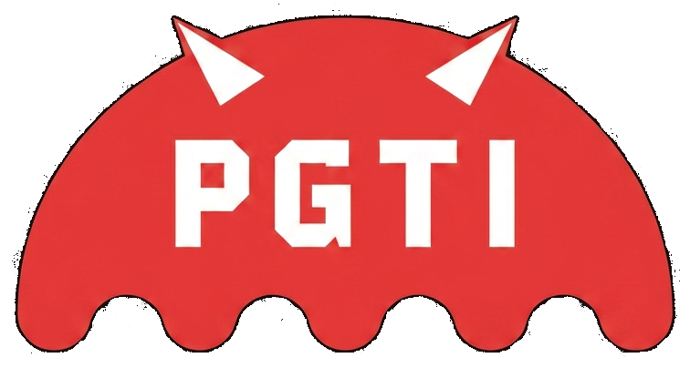
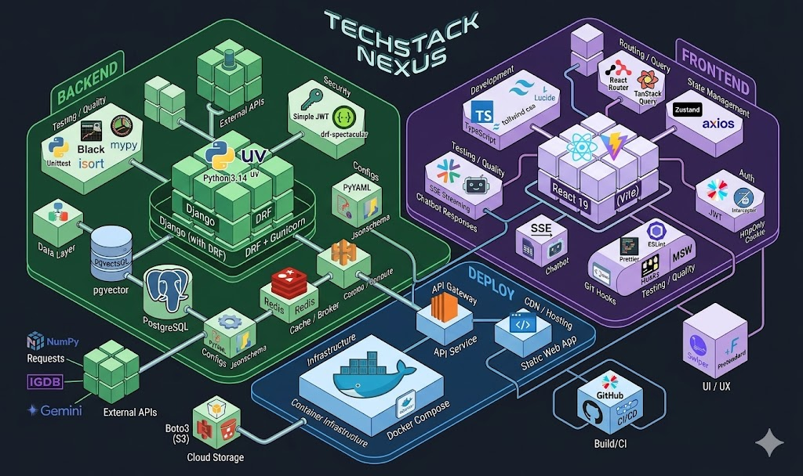

# PGTI Frontend

## 📖 프로젝트 소개

> PGTI는 사용자가 게임을 탐색하고, 설문조사 또는 매칭 평가를 통해 취향 기반 추천을 받는 웹 서비스입니다.
> 취향을 묻고, 장르를 비교하고, 마음에 드는 게임을 저장하면서 나에게 맞는 다음 게임을 더 쉽게 찾을 수 있도록 돕습니다.
> 게임 선택이 고민될 때 취향 기반 추천으로 방향을 잡아주는 서비스, `PGTI`에 오신 걸 환영합니다!

---

## 🔗 배포 링크

> ### [PGTI 서비스 바로가기](https://oz-union-16-fe.vercel.app/)

---

## 🗣️ 프로젝트 발표 문서

> ### 🗓️ 프로젝트 기간: 2026.04.02 - 2026.05.07
>
> ### 🗓️ 발표일: 2026.05.08
>
> ### [📑 발표 문서](https://docs.google.com/presentation/d/16KPPXli8xbO25PxbUyLGPigRbOWjtyIeQ5ozWgZ-voY/edit?slide=id.g3e7af5dcf11_0_224&pli=1#slide=id.g3e7af5dcf11_0_224)

---

## 🖥️ 서비스 소개

|                             PGTI 로고                              |
| :----------------------------------------------------------------: |
|  |

PGTI는 게임 탐색, 설문 기반 추천, 장르별 매칭, 추천 결과 확인, 좋아요 게임 관리, 고객센터 챗봇을 제공하는 프론트엔드 서비스입니다.

---

## 🧰 사용 스택

### 🛠️ System Architecture



### FE

<div align="center">
  
  
  
  
  <br>
  
  
  
  
  <br>
  
  
  
  
  <br>
  
  
  
</div>

---

## 👥 팀 동료

### FE

| <a href="https://github.com/ninanochichi"><br><sub><b>@ninanochichi</b></sub></a><br> | <a href="https://github.com/hj-devlog"><br><sub><b>@hj-devlog</b></sub></a><br> |
| :----------------------------------------------------------------------------------------------------------------------------------------------------------------------------------: | :-------------------------------------------------------------------------------------------------------------------------------------------------------------------------: |
|                                                                                    FE 팀장 김우진                                                                                    |                                                                               FE 팀원 진현진                                                                                |

---

## 📑 프로젝트 규칙

### Branch Strategy

> - `dev` 브랜치에서 작업 브랜치를 생성합니다.
> - `main`, `dev` 직접 push를 제한합니다.
> - PR 전 최소 1인 이상 승인 후 병합합니다.
> - 브랜치 이름은 아래 형식을 따릅니다.

```text
main
dev
feat/<slug>
fix/<slug>
docs/<slug>
refactor/<slug>
test/<slug>
chore/<slug>
release/<value>
hotfix/<value>
```

### Git Convention

> 커밋 메시지는 `type(scope): subject` 형식을 사용합니다.

```text
feat(main-page): add top games section
docs(readme): update project guide
fix(auth): handle login redirect
```

| Type     | 설명                                     |
| -------- | ---------------------------------------- |
| feat     | 새로운 기능 구현                         |
| fix      | 버그 수정                                |
| docs     | 문서 추가 및 수정                        |
| style    | 코드 의미에 영향을 주지 않는 스타일 변경 |
| refactor | 코드 리팩토링                            |
| test     | 테스트 추가 및 수정                      |
| chore    | 기타 작업                                |
| perf     | 성능 개선                                |
| ci       | CI 설정                                  |
| revert   | 변경 되돌리기                            |

### Pull Request

> ### Title
>
> 제목은 `[Feat] 홈 페이지 구현`과 같이 작성합니다.

> ### PR Type
>
> - [ ] FEAT: 새로운 기능 구현
> - [ ] FIX: 버그 수정
> - [ ] DOCS: 문서 추가 및 수정
> - [ ] STYLE: 스타일 변경
> - [ ] REFACTOR: 코드 리팩토링
> - [ ] TEST: 테스트 관련
> - [ ] CHORE: 기타 작업

> ### Description
>
> 구체적인 작업 내용을 작성합니다.
> UI 변경이 있다면 스크린샷을 첨부합니다.

> ### Validation
>
> 아래 명령 실행 결과를 작성합니다.

```bash
npm run lint
npm run build
```

### Code Convention

> FE
>
> - 사용자에게 보이는 UI 문구는 한국어로 작성합니다.
> - 누락 데이터는 요구사항 기준에 맞춰 `N/A` 또는 명확한 빈 상태로 표시합니다.
> - API 응답 필드명이 흔들릴 수 있는 값은 화면 컴포넌트가 아닌 API adapter 또는 normalizer 경계에서 처리합니다.
> - 페이지와 상위 컴포넌트는 핵심 흐름이 위에서 아래로 읽히도록 구성합니다.
> - API 통신은 api 모듈, 상태와 흐름은 hook 또는 store, 순수 UI는 component로 책임을 나눕니다.
> - 이미지에는 대체 텍스트를 작성합니다.
> - 버튼은 로딩/비활성 상태를 표현합니다.
> - 새 의존성은 팀 합의 없이 추가하지 않습니다.

### Communication Rules

> - Notion 활용
> - Discord 활용
> - Daily Scrum 진행
> - Figma 기반 화면 정의 및 디자인 공유

---

## 📋 Documents

> [📜 API 명세서](https://docs.google.com/spreadsheets/d/1t5-N2UagMHkSlAh0EDdIFAy9Rw50YANsPAwtmFKIO24/edit?gid=0#gid=0)
>
> [📜 요구사항 정의서](https://docs.google.com/spreadsheets/d/15xdRQQAxHQuG0IHL9FNqa-gkL7mvtJbWtkOYCG9p0yA/edit?pli=1&gid=428803499#gid=428803499)
>
> [📜 ERD](https://www.erdcloud.com/)
>
> [📜 테이블 명세서](https://docs.google.com/spreadsheets/d/1tRDH3Ek6puT4LioW3XtGh8wEiVZOrX6AQ45mApxQknA/edit?gid=0#gid=0)
>
> [📜 화면 정의서](https://www.figma.com/design/AfieCpDpJT7OUDs6enkdsw/%ED%95%A9%EB%8F%99%ED%94%84%EB%A1%9C%EC%A0%9D%ED%8A%B8-%ED%94%84%EB%A1%A0%ED%8A%B8%EC%97%94%EB%93%9C-1%ED%8C%80-%ED%99%94%EB%A9%B4%EC%A0%95%EC%9D%98%EC%84%9C?node-id=0-1&p=f&t=9NKDjRLAvbjtp8ZO-0)
